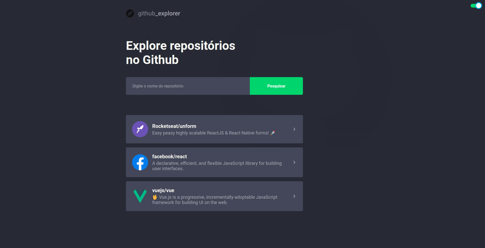
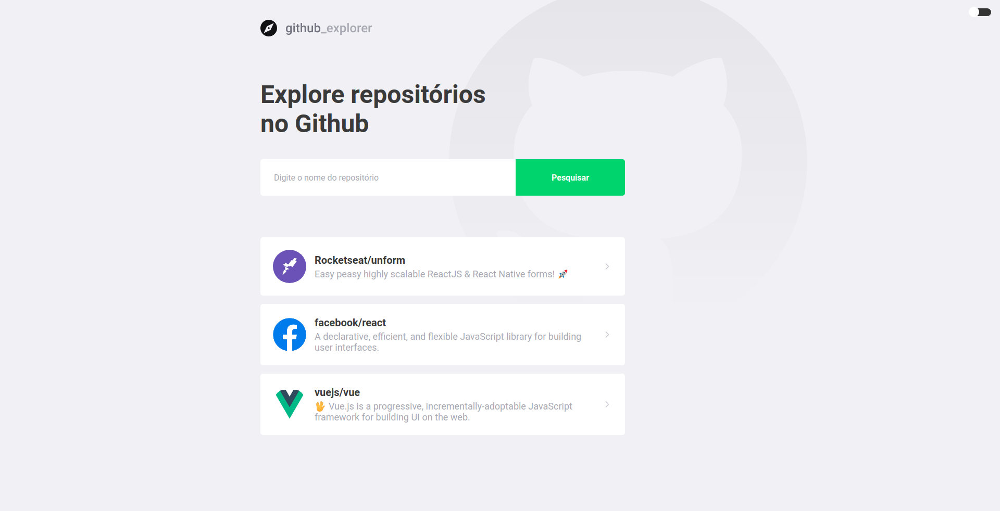

<h1 align="center">
  
</h1>

<h3 align="center">Github Explorer</h3>


<p align="center">
  
  
</p>

## Sobre
  - Aplicação que busca repositórios no GitHub e mostra suas informações como Issuues, Forks e Stars.
- É possivel também mudar o tema da aplicação.

## 🔧 Tecnologias
<p>Esse projeto foi desenvolvido com as seguintes tecnologias:</p>

- [ReactJS](https://reactjs.org/)
- [ReactHooks](https://pt-br.reactjs.org/docs/hooks-intro.html)
- [Axios](https://github.com/axios/axios)
- [styled-components](https://styled-components.com/)
- [react-icons](https://react-icons.netlify.com/#/)
- [react-switch](https://www.npmjs.com/package/react-switch)


## 💾 Instalação

```bash
# Clone o repositório
https://github.com/rodrigosakamoto/github-explorer.git

# Em seguida execute:
$ cd github-explorer

$ yarn

# Para iniciar a aplicação
$ yarn start
```
---
By [Rodrigo Sakamoto](https://www.linkedin.com/in/rodrigo-sakamoto/)
